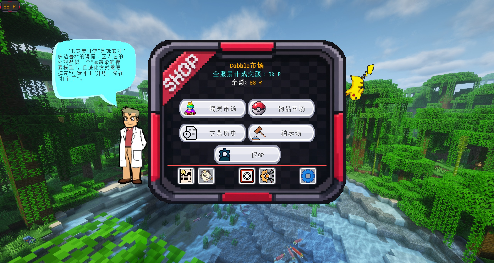

<!--
  首页排版说明（改之前先读）：

  1. 块级 HTML 内部不能留空行 —— markdown 解析器一遇到空行就认为 HTML 块结束，
     后面的内容会重新按 markdown 解析，结构会散掉。
  2. 站内链接有两种写法，规则正好相反，别混：
     · HTML 块里的原生 <a> 要写 `#/features` —— 浏览器自己处理 hash 跳转，docsify 路由响应；
     · markdown 语法的 [文字](/features) 要写 `/features` —— 由 docsify 编译，
       写成 `#/` 开头会被它当成「当前页锚点」，点了原地不动。
  3. 按钮行故意写成 markdown 段落（不是 HTML 块），样式靠 `.cm-hero + p`
     相邻选择器挂上去，省掉一个容易写错的链接前缀。
  4. 图片一律用  标签，不用 markdown 的  —— 后者会被 docsify 按当前页面
     目录重写路径，英文站会变成 /en/images/... 直接 404。
-->

  
  

    <!-- ⚠ 这个 tabindex="-1" 别删：docsify 的无障碍焦点逻辑（#focusContent）会找
         「#main 里第一个标题」，自己给它补上 tabindex 后**平滑滚过去**
         （scrollIntoView({behavior:'smooth'})）。首页这个标题在封面之后，
         于是「点首页」会变成先滚到 hero（跳过封面）、再被拉回顶部，看起来就是
         "上移过多再下移"。预先写死 tabindex，它就不会自己补标记、也就不会滚
         （它只在「自己加过 tabindex」时才滚）。 -->
    <h1 tabindex="-1">CobbleMarket</h1>
    
面向 Cobblemon 服务器的玩家交易市场模组 —— 但不止于此，它同时也是一套面向服主的服务器经济运营工具。

    

      Minecraft 1.21.1
      Fabric
      NeoForge
      免费开源 · GPL-3.0
    

  

[下载模组](https://www.curseforge.com/minecraft/mc-mods/cobblemarket)
[功能特色](/features)
[☕ 支持开发](/support)

  
4大交易玩法

  
4种货币模式

  
2平台版本

  
0功能限制

## 四大交易玩法

  

    
    
精灵市场

    
从队伍或 PC 上架精灵，浏览并购买全服挂单。可按属性、特性、性格、个体值、闪光、特训等条件筛选。

  

  

    
    
物品市场

    
背包物品上架，买家可购买任意数量。搜索支持按招式名与附魔名直达具体变体。

  

  

    
    
拍卖场

    
限时拍卖，实时倒计时与竞价、反狙击自动延长、到期自动结算，上架与成交全服播报。

  

  

    
    
求购单

    
挂出你想要的东西与价格，其他玩家交付、你确认后成交。支持精灵与物品，可附带附魔等组件要求。

  

所有交易由服务端校验、客户端仅负责显示，客户端作弊无法凭空获得货币或物品。

## 更多能力

- **喵喵银行**（可选，默认关闭）—— 信用借贷、3/6 / 12 期分期还款、活期存款、逾期三档制裁，以及额度凭证「喵·紫金卡/喵·黑金卡」
- **交易历史与账本** —— 游戏内历史界面，外加面向服主的 CSV 账本（交易账本回答「货去哪了」，信用账本回答「钱怎么走的」）
- **管理工具** —— 黑名单、价格限制、封禁、强制下架、市场总开关，以及游戏内可视化服务器配置
- **个性化显示** —— 精灵 3D 图标与动画、证章与体型徽章、余额 HUD 位置自定义、庆祝动画等玩家侧开关

完整功能清单见 [功能特色](/features)，历次改动见 [更新日志](/changelog)。

## 快速上手

1. 装好模组与依赖（见 [安装与快速上手](/install)），启动服务器或进入单人世界
2. 按 `K`、输入 `/market gui`，或从 Cobblemon Smartphone 应用进入市场
3. 在市场里上架你的精灵或物品，或直接购买别人的挂单

> 服主第一次使用建议先看 [配置参考](/config) 与 [货币系统](/currency)，确认货币模式后再开放给玩家。

## 安装要求

| 项目 | 要求 |
|---|---|
| Minecraft | 1.21.1 |
| Cobblemon | **1.8.0 及以上、1.9 以下** |
| Fabric | Fabric API + Fabric Language Kotlin |
| NeoForge | Kotlin for Forge + Cobblemon（NeoForge 版），**无需** Architectury API |

**同时提供 Fabric 与 NeoForge 两个版本**，功能一致、存档互通。

虚拟货币可选配 [CobbleDollars](https://modrinth.com/mod/cobbledollars) 或 [Impactor](https://modrinth.com/mod/impactor)；不装则使用物品货币（默认钻石）。**[Cobblemon Economy](https://modrinth.com/mod/cobblemon-economy) 与 Cobblemon 1.8+ 不兼容**（启用会导致玩家获得或升级精灵时崩服），详见 [货币系统](/currency)。

## 安全与下载

**请仅从 CurseForge 官方页面下载。** 来自其他渠道的 jar（QQ 群、他人转发、第三方下载站）无法保证安全。官方文件均可与 CurseForge 页面显示的 SHA-256 哈希核对。

本模组采用服务端权威架构，客户端作弊无法凭空获得货币或物品。完整防御设计见 [安全设计](/security)。

## 支持开发

CobbleMarket 完全免费、没有任何功能限制 —— 所有功能对所有人开放，赞助与否都一样用。

如果它帮到了你的服务器，可以请作者喝杯咖啡 ☕

[☕ 请我喝咖啡](/support)

## 支持与反馈

- 问题反馈与功能建议：[GitHub Issues](https://github.com/ShuShengA/cobblemarket/issues)
- 更新内容见 [更新日志](/changelog)

## 许可证

**GPL-3.0** —— 分发修改后的版本时必须以同样的许可证开源，并保留原版权声明。
Copyright (C) 2026 Shu_ShengA.

> 1.0.1 及更早版本以 MIT 许可证发布，1.1.0 起改用 GPL-3.0。
