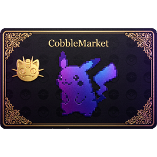
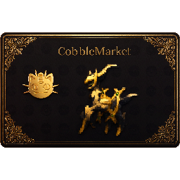

<!-- 背景图由 index.html 的 .cover 样式提供 -->

<!-- ⚠ 版本亮点装饰：换版本时改下面的版本号，或把这三个元素整段删掉
     （样式见 index.html 的 .cm-cover-card / .cm-cover-ver） -->

1.1

# CobbleMarket

> 面向 Cobblemon 服务器的玩家交易市场模组

- 精灵市场/物品市场/拍卖场/求购单
- 可选喵喵银行金融系统：信用借贷、存款与卡片凭证
- 四种货币自动适配，Fabric 与 NeoForge 双平台
- 服主管理工具、CSV 账本与数据备份

[开始了解](/features)
[下载模组](https://www.curseforge.com/minecraft/mc-mods/cobblemarket)
[☕ 支持开发](/support)
