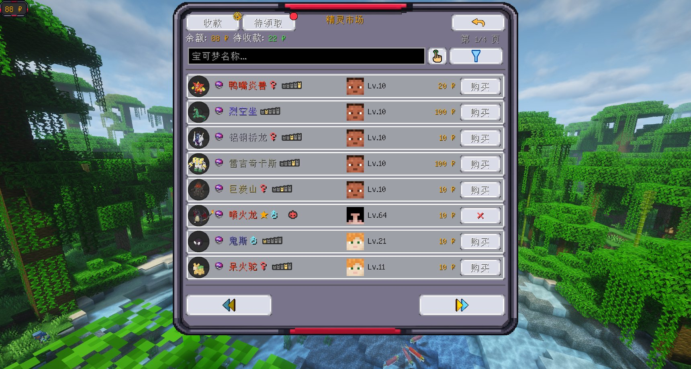
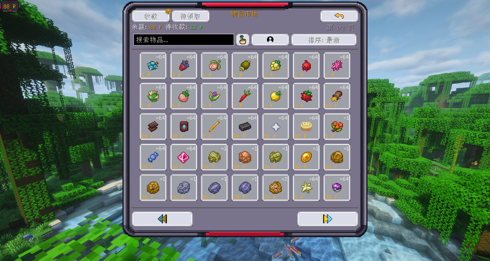
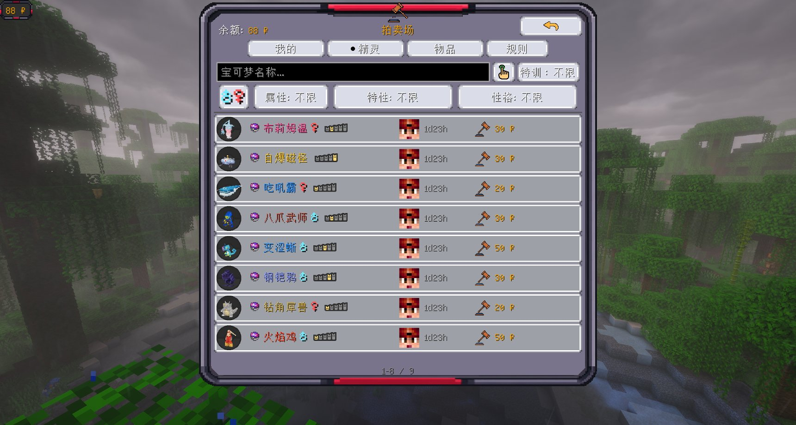
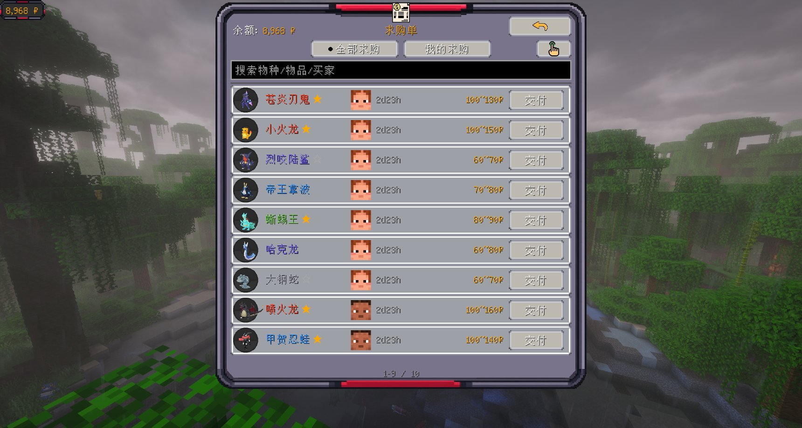
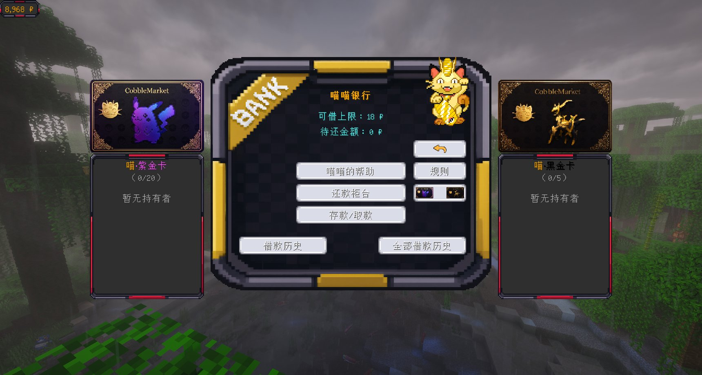
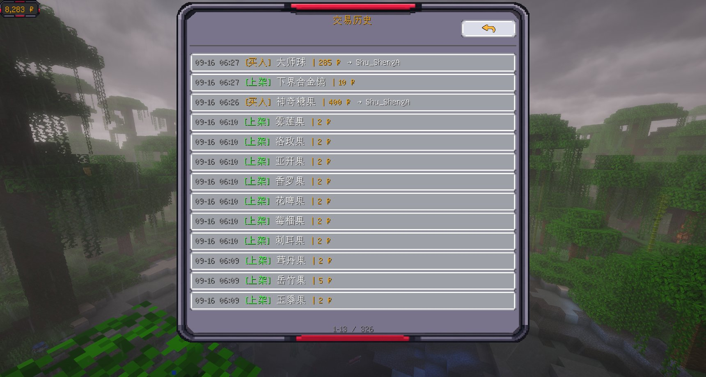

# 功能特色

CobbleMarket 把「玩家之间怎么交易」这件事做完整了 —— 从挂单、砍价、竞拍到交付、结算、对账，每一环都有对应的界面与规则。下面按功能域逐项说明。

## 精灵市场

从**队伍或 PC** 上架精灵，浏览并购买全服挂单。

- **筛选**：属性、特性、性格、个体值、闪光、特训、性别，逐项收窄
- **悬停详情**：等级、球种、属性、性格（含性格薄荷的生效性格）、特性、六项个体值（特训显示为「真实值（特训值）」）、亲密度、证章、体型、携带物
- **精灵 3D 图标**：列表与详情里的精灵图标默认播放 Cobblemon 内置待机动画，可在设置里切回完全静态

## 物品市场

背包物品上架，买家可购买**任意数量**。

- **搜索直达变体**：支持按物品 ID、名称与完整 tooltip 文本搜索；Cobblemon 招式学习器可按招式名、附魔书可按附魔名与等级精确定位（搜「打鼾」直接找到打鼾的招式学习器）
- **完整物品词条**：所有列表与悬停使用真实物品词条，招式名、附魔名与罗马数字等级完整可见；按住 `Shift` 展开完整词条、按住 `Ctrl` 显示组件明细
- **稀有度着色**：物品名按稀有度着色，与物品栏一致

## 拍卖场

限时拍卖，**实时倒计时**与竞价，到期自动结算。

- **三个页签**：我的/精灵/物品
- **竞价规则**：出价立即扣款；被超价自动退回待收款；自己连续加价只补差价；不能给自己的拍卖出价；低于「当前价 + 最低加价」会被拒绝并提示
- **反狙击**：结束前 120 秒内出价会自动延长结束时间（秒数可配）
- **自动结算**：到期由服务端结算，无需有人打开界面 —— 成交进待领取、卖家收款并扣手续费，无人出价则流拍退回
- **全服播报**：上架与成交都会在聊天框播报，拍品名可悬停查看详情、点击直达出价界面
- **拍卖音效**：出价确认音；结束前 10/6 / 3 秒三声渐强锤声；成交落槌与铃声（只发给参与方，不打扰围观者）

## 求购单

挂出**你想要的东西与价格**，由其他玩家交付。

- **精灵求购**：物种（留空 = 任意精灵）、闪光、特训、六项个体值、形态、特性、性格
- **物品求购**：可附带附魔等**组件要求**，交付物品不满足则被拒绝
- **资金模式**：发布时冻结「最高单价 × 数量」，成交按实际价结算并退还差价，关闭或过期自动退还
- **买家确认制**：卖家交付先进入「待确认」，货物悬空、资金不结算、重启不丢；买家看过完整货物信息后再决定接受或拒绝（拒绝可留言）
- **部分交付**：多个卖家可对同一物品单分别交付，凑满件数自动关闭

## 喵喵银行（可选金融系统）

默认关闭。开启后为服务器注入**资金流动性**，同时是服主的运营杠杆 —— 利率、额度、逾期制裁全部可配。

- **信用借贷**：按 3/6 / 12 期偿还（每 7 天一期），可用额度按玩家历史交易额自动计算，借款即时到账
- **还款柜台**：未结清借款一目了然，可「还一期」或「提前结清」（剩余本金 + 实算利息一次付清）
- **自动划扣与逾期**：每期到期自动从余额划扣（保留保底余额）；余额不足进入逾期 —— 禁止新增借款并按天累积逾期利息，还清后自动恢复
- **逾期三档制裁**：逾期 7 天手续费翻倍 → 14 天市场交易冻结 → 30 天注销为坏账（服主收到告警，可手动撤销）
- **活期存款**：闲钱存入按日计息、随时可取，存款充实准备金池形成存贷闭环
- **喵喵支付**：购买时可选择信用消费，由服务器准备金垫付给卖家，买家分期偿还
- **卡片凭证**：喵·紫金卡/喵·黑金卡 —— 高额度凭证，额度绑定持有者而非物品（复制出的卡无效），可配置手续费减免与自行申请门槛
- **防刷设计**：额度增长冷却、同 IP 欠款上限、交易对检测、存贷利率护栏（杜绝「借钱存银行吃利息」）
- **信用账本**：借贷与还款全量写入独立 CSV 账本，中英双份按天分文件，供服主查账

## 交易历史与账本

- **游戏内历史界面**：个人交易历史查最近 14 天账本（每人最多 500 条），管理员面板可查全服流水
- **CSV 交易账本**：市场、拍卖、求购单全链路写入，含「详情」列记录精灵完整数值与物品组件，可**精确复刻货物**
- **CSV 信用账本**：借款创建/逾期/结清事件与每笔还款的本金利息拆分，还款方式分明
- 账本**同步写盘**，不依赖自动保存，崩溃或杀进程也不丢

## 服主管理工具

- **黑名单**：精灵与物品双页签，可精确到**物品变体**（如只禁「锋利 V」的附魔书而不影响其它附魔书，条目按包含匹配防绕过），支持从手持物品添加、批量拉黑与按搜索结果精确解封
- **价格限制**：可按精灵形态、物品变体设上下限，多条目按「最具体条目优先」生效
- **封禁**：封禁玩家交易并支持时长与理由；封禁只限制交易，**不会冻结资产**
- **强制下架**：管理员面板可查看全部挂单、拍卖与求购单并强制下架，买卖双方均收到通知（离线则上线补发）
- **市场总开关**：遇到漏洞等紧急情况可一键停市（二次确认），OP 仍可进管理员面板清理
- **服务器配置界面**：费率、上限、时长、开关等直接在游戏内编辑，无需改配置文件

## 其他特色

- **大木博士**：入口界面常驻立绘，头顶气泡随机展示宝可梦冷知识（内置 498 条中英双语，可自行增删替换）
- **离线通知**：玩家不在线时的交易通知自动入队，上线后按玩家语言补发
- **余额 HUD**：左上角常驻显示市场余额，可拖动到屏幕任意位置并自动吸附对齐
- **全服累计成交额**：入口界面展示服务器经济规模
- **极限特训支持**：适配 Cobblemon Utility+，特训后的个体值显示为「真实值（特训值）」，判定按有效值
- **容器内容校验**：黑名单、价格限制与蛋交易开关对潜影箱等容器内的物品同样生效
- **精灵蛋交易**：兼容 Cobbreeding（默认关闭，需服主开启并二次确认）
- **配置热重载**：`/market reload` 应用配置修改，免重启
- **数据备份**：每次启动校验数据文件，损坏时自动从 `.bak` 恢复；无备份可用时保留 `.dat.corrupt` 供人工修复

---

想了解每个功能的细节规则与配置？见 [配置参考](/config) 与 [更新日志](/changelog)。
